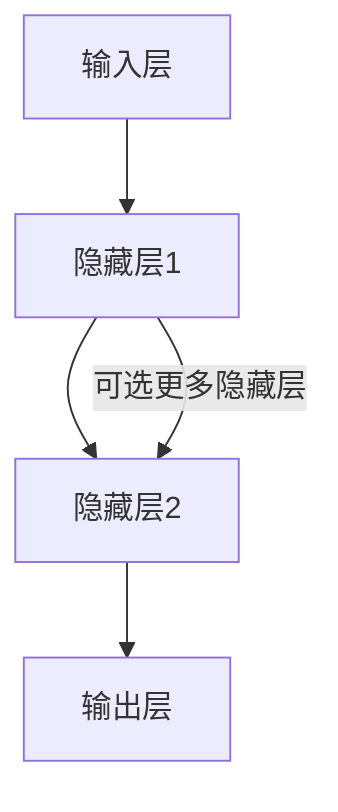

# Feedforward Neural Network in Rust

## 实现方案

### 1. 网络结构设计
- **层（Layer）**：每一层包含若干神经元。
- **神经元（Neuron）**：每个神经元有权重和偏置。
- **激活函数（Activation Function）**：如 ReLU、Sigmoid、Tanh。
- **网络参数**：权重和偏置以向量/矩阵形式存储。

### 结构图

### 2. 前向传播（Forward Propagation）
- 输入数据经过每一层的线性变换（加权求和+偏置），再通过激活函数。
- 最终输出用于分类或回归。

### 3. 损失函数（Loss Function）
- 用于衡量预测值与真实值的差距。
- 常用如均方误差（MSE）、交叉熵等。

### 4. 反向传播与训练（可选）
- 计算损失函数对参数的梯度。
- 使用梯度下降等优化算法更新参数。

### 5. 推理接口
- 提供简单的 API 用于输入数据并获得预测结果。

### 6. 代码结构建议
- `src/layer.rs`：定义层结构体和方法。
- `src/network.rs`：定义网络整体结构和前向传播方法。
- `src/activation.rs`：实现激活函数。
- `src/main.rs`：示例入口，演示如何创建和使用网络。

---

## 迭代实现计划

1. **最简版实现**
   - 单隐藏层、固定激活函数（如 Sigmoid），仅支持前向传播。
   - 输入、输出、权重、偏置的基本结构。
2. **支持多层网络**
   - 支持任意数量的隐藏层。
   - 层与层之间参数自动初始化。
3. **激活函数模块化**
   - 支持多种激活函数（ReLU、Tanh、Sigmoid等）。
4. **损失函数与训练**
   - 实现损失函数。
   - 实现反向传播和简单的梯度下降训练。
5. **接口与扩展**
   - 提供推理和训练接口。
   - 支持模型保存与加载。

如需扩展，可增加保存/加载模型、支持多种优化器等功能。 
